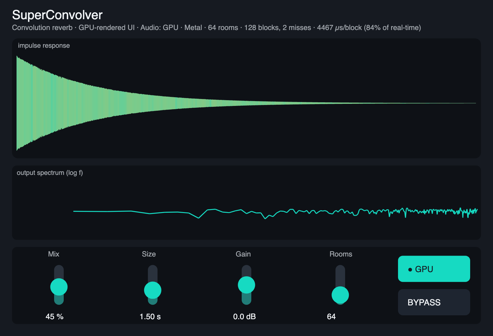
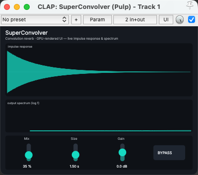

# SuperConvolver

A convolution reverb with a GPU-rendered UI, built on [Pulp](https://github.com/danielraffel/pulp). Signed and notarized for macOS (Apple Silicon).

> Temporary distribution repo for sharing preview builds. The source lives in the Pulp repo (`examples/super-convolver`).

Running as a CLAP plugin in REAPER:

## ⚠️ Apple Silicon native — run your host natively (not Rosetta)

These builds are **arm64 (Apple Silicon) only**. A host running under **Rosetta (x86_64)** cannot load an arm64-only plugin — it shows up as *"couldn't be opened"* / not found. If a plugin won't load:

1. Quit your DAW.
2. In **Applications**, right-click the DAW → **Get Info** → **uncheck "Open using Rosetta"**.
3. Relaunch. (Ableton Live 11.3+, Logic, REAPER, Bitwig all run natively on Apple Silicon.)

If it still won't load, run **SuperConvolver Diagnostics** (below) and send back the report.

## Download

Grab the latest [release](../../releases/latest) — a single installer:

- **`SuperConvolver-1.0.2.pkg`** — one notarized installer. Its **Customize** pane lets you pick any of:
  - **Audio Unit (AU)** → Logic Pro, GarageBand
  - **VST3** → most DAWs
  - **CLAP** → REAPER, Bitwig
  - **Standalone app** → `SuperConvolver.app` in Applications (no DAW needed)
  - **Diagnostics helper** → if a plugin won't load, run it; it writes a report **.zip to your Desktop** (system info, per-format install/sign/quarantine status, **executable architecture**, `auval`). Send that zip back.

Signed with a Developer ID and notarized by Apple, so it opens without Gatekeeper warnings.

## What it is

- **Convolution reverb** — your signal convolved with a decaying impulse response. The **Size** knob morphs the IR live (rebuilt off the audio thread, swapped in lock-free). Correct under any host block size (internal re-blocking; ~5.3 ms reported latency for host PDC).
- **GPU-rendered UI** — a live impulse-response waveform tinted by the output spectrum, a log-frequency spectrum display, and Mix / Size / Gain + Bypass, drawn through Pulp's Skia/Dawn GPU surface and themed with Pulp's *Ink & Signal* design language.
- **Mix** dry/wet, **Size** reverb length (0.05–4 s), **Gain** output trim, **Bypass**.

## Requirements

macOS on Apple Silicon (arm64). Run your DAW natively (not under Rosetta).

## Feedback

It's a preview — expect rough edges. Issues and notes welcome.
